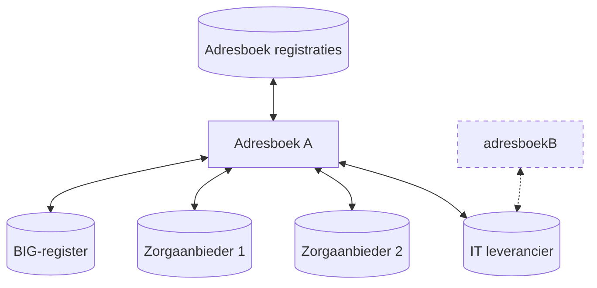

# Technisch ontwerp

Dit document beschrijft hoe de adresseringsfunctie ingevuld kan worden om de
gebruikscasussen te realiseren.

## Adresboek

De adresseringsfunctie wordt vormgegeven door een adresboek. Een partij die
informatie zoekt over een organisatie kan een adresboek gebruiken. Dit adresboek
wordt door verschillende partijen gevuld.

Een dergelijk adresboek kan, via FHIR mCSD, opgebouwd worden. Dit maakt het
mogelijk om meerdere adresboeken te hebben. Elk adresboek kan onafhankelijk van
de andere adresboeken functioneren.

Dit maakt de totale infrastructuur robuust (geen single-point-of-failure). Ook
voorkomt het een afhankelijkheid van een enkele partij.

De lijst van aangesloten leveranciers van gegevens kan centraal worden beheerd.
Dit is een technisch laag-complexe activiteit omdat dit enkel de gegevens bevat
over welke bronsystemen er zijn.

Binnen dit document wordt omwille van tekstuele duidelijkheid vaak het
enkelvoudige *adresboek* gebruikt. Hiermee wordt, tenzij expliciet aangegeven,
een van de adresboeken of de collectie van adresboeken bedoeld.

De topologie van de uiteindelijke oplossing kan er als volgt uit komen te zien.

## Bronhouders

Er bestaan drie type partijen die (direct) bron data kunnen leveren voor de
adresseringsfunctie. Dit zijn zorgorganisaties, KvK geregistreerde organisaties
en het BIG-register. Alle zorgorganisaties moeten in staan zijn hun gegevens te
registreren bij een van de adresboeken.

Naast zorgorganisaties zijn er ook andere organisaties zoals IT-leveranciers
betrokken bij het zorgveld. Deze kunnen, na een toelatingsprocedure, data
leveren ten behoeve van de adresseringsfunctie.

Het BIG-register heeft een aparte rol die voorzien is als leverancier van
de gegevens voor de Practitioner entiteit.

## Onderlinge relaties

Binnen het FHIR mCSD datamodel is het mogelijk relaties te maken tussen
verschillende entiteiten. Indien de relaties binnen de organisatie zelf
plaatsvinden (zie namespaces) kan dit direct worden overgenomen in het
adresboek.

Op het moment dat er een relatie gemaakt wordt tussen organisaties, bijvoorbeeld
via een Affiliation entiteit, dan dient het adresboek een aanvullende controle
te doen.

De controle die in dit geval plaatsvindt, is gebaseerd op wederzijdse
goedkeuring. Wanneer beide organisaties de relatie opgenomen hebben zal het
adresboek deze relatie accepteren.

## Identificatie van entiteiten

Entiteiten hebben een eigen ID nodig in het FHIR mCSD datamodel. 

## Basis set

Een organisatie dient tenminste de een hoofdorganisatie entiteit aan te leveren.
Daarnaast heeft het adresboek in de basis kennis van de FHIR mCSD datatypes.

Voor het Affiliation datatype gelden extra regels (zie [Onderlinge
relaties](#onderlinge-relaties)).

De Practitioner entiteit komt volledig tot stand via het BIG-register.

Een zorgorganisatie dient tenminste een URA ID te hebben. Andere organisaties
hebben tenminste een KvK ID.

## Uitbreidbaar

Het datamodel van FHIR mCSD bied vrijheid om nieuwe gegevenstypes toe te voegen.
Om het adresboek zo flexibel mogelijk te houden zal het alle aangeleverde data,
met uitzondering van data die controle behoeft, accepteren en opnemen.

Hierdoor kunnen bijvoorbeeld een AGB-code, het resultaat van kwalificatie of
andere gegevens geregistreerd worden. Dit maakt het adresboek bruikbaar voor
zowel de gebruikscasussen die nu voorzien zijn als toekomstige.

Systemen die gebruik maken van het adresboek kunnen enkel vertrouwen op het feit
dat de betreffende gegevens door of namens de organisatie zijn aangeleverd.
Indien aanvullende verificatie vereist is moeten deze systemen dit zelf doen op
basis van de bij de casus passende technieken. Dit kan bijvoorbeeld gedaan
worden door een gegeven als een [Verifiable
Credential](https://www.w3.org/TR/vc-data-model/) op te nemen.

## Technische opzet FHIR mCSD

Voor de opzet van het adresboek wordt uitgegaan van een model waarbij het
adresboek zowel een *Care Services Selective Supplier* (opzoek systeem) rol
heeft als een *Care Services Update Consumer* (systeem wat gegevens ophaalt)
rol. De [bronhouders](#bronhouders) leveren data aan het adresboek via de *Care
Services Update Supplier* rol.

Elke bronhouder registreert één endpoint bij het adresboek. Indien de bronhouder
zelf verschillende bronnen wil samenvoegen dan is deze daar zelf voor
verantwoordelijk. Dit model voorkomt dat het adresboek conflict resolutie logica
nodig heeft en dat hierdoor onverwachte situaties kunnen optreden. 

Bij deze opzet wordt uitgegaan van een verversing van enkele keren per dag. Een
*Care Services Selective Consumer* mag er echter niet van uitgaan dat de
informatie in het adresboek jonger dan een dag is. Het adresboek kan daarmee
bijvoorbeeld niet worden gebruikt voor het bepalen van het aantal beschikbare
bedden. Wel zou een endpoint opgehaald kunnen worden van API via welke het
aantal beschikbare bedden uitgelezen kan worden.

## Opzoekmogelijkheden

Bij het uitvragen van het adresboek dienen de verschillende casussen ondersteund
te worden. Dit vraagt dat het adresboek een index maakt waardoor het snel de
betreffende vragen kan beantwoorden.

Ook de [FHIR mCSD specificatie](https://profiles.ihe.net/ITI/mCSD/ITI-90.html)
schrijft een aantal velden voor die doorzoekbaar dienen te zijn. Een van deze
eigenschappen die extra toelichting behoeft, is de `Identifier`. Deze kan binnen
FHIR meerdere keren voorkomen op een entiteit. Elke `Identifier` heeft een
`type` en een `value`.

Dit maakt het mogelijk dit veld in te zetten voor verschillende doeleinden.
Hierbij kan gedacht worden aan het mogelijk maken van het zoeken naar een
organisatie op basis van een AGB-code (`type=agb` en `value=xyz`). 

### Ophalen van endpoints via IT-leverancier

In de casus waarbij een IT-leverancier de endpoints van een organisatie beheerd
is het gewenst om via één zoekopdracht alle endpoints op te halen die zijn. Dit
gaat dan om de endpoints die direct op de zorgorganisatie geregistreerd alsook
de endpoints die op de IT-organisatie geregistreerd zijn.

FHIR maakt dit mogelijk door in de zoekopdracht de mogelijkheid te geven om
gerelateerde gegevens mee te laten zoeken (`_revInclude=...`). In dit geval zal
de Affiliation gebruikt worden. Het `code` attribuut op de Affiliation heeft
hiervoor een value set. Deze wordt voor het adresboek aangepast naar een value
set met een additionele *connectivity supplier* rol. Op basis van de
*connectivity supplier* rol kunnen de relevante Affiliation entiteiten voor het
bepalen van de endpoints geselecteerd worden.

## Stelselbeheer en techniek

Bij een deel van de voorwaarden voor het correct functioneren van het adresboek
wordt uitgegaan van een stelsel wat regie voert op het adresboek. 

### Toegangscontrole

Een van de punten waar een taak ligt voor het stelsel, is bepalen welke partijen
toegang hebben tot het adresboek. Voor zorgaanbieders zou toegang bepaald kunnen
worden op basis van een al bestaand stelsel (UZI/Dezi). Identificatie van een
zorgaanbieder kan vervolgens plaatsvinden met een middel dat via dat stelsel
uitgegeven wordt (bijvoorbeeld een certificaat). Organisaties die geen
zorgaanbieder zijn zullen via het stelsel geregistreerd moeten worden.

## Publicatie aangesloten bronnen

## Bronnen

- [FHIR mCSD ITI-90](https://profiles.ihe.net/ITI/mCSD/ITI-90.html)